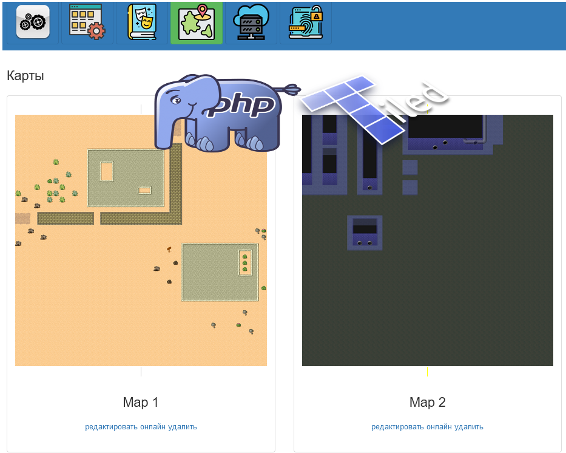

Приложение является частью репозитория [Движок](https://github.com/webrobot1/engine) в составе проекта "Онлайн игры"

Служит для управления игровыми картами, в тч:

:white_check_mark:    [Импорт](model/Tiled/Xml) карт из [Tiled](https://www.mapeditor.org/) в Mysql (слои, объекты, физика, анимации и тд)    
:white_check_mark: 	  Предпросмотр загруженых карт в PHP (библиотека [GD](model/Tiled/GD))    
:white_check_mark: 	  Передача карт (целиком спрайтом или отдельными слоями, элементами, колайдерами) по API в [Unity](https://github.com/webrobot1/unity)   
:black_square_button: Интеграция карт с [Phaser](https://www.phaser.io/)    
:black_square_button: Изменение карт на стороне приложения (добавление npc, предметов точек перехода на другую карту ...) 

С технической точки зрения наибольших интерес представлет библиотека [model/Tiled/](model/Tiled/) которая реализует собственную ORM
